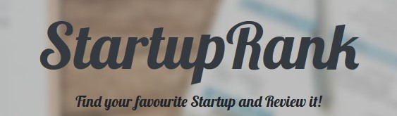

# StartupRank
## Find your favourite Startup and review it!

### About
This website was created as a bonus project within the course Information Systems Implementation and Architecture and with the supervision of professor <a href="https://www.aueb.gr/el/faculty_page/%CF%80%CF%81%CE%B1%CE%BC%CE%B1%CF%84%CE%B1%CF%81%CE%B7-%CE%B1%CE%B9%CE%BA%CE%B1%CF%84%CE%B5%CF%81%CE%B9%CE%BD%CE%B7">Pramatari</a> and professor <a href="https://eltrun.gr/members/dr-stavros-lounis/">Lounis</a>.The purpose of this website is to get familiar with the MVC Django. 

### In case you want to add/change/fix something
* Open an issue
* Let's discuss about it there
* Contribute
